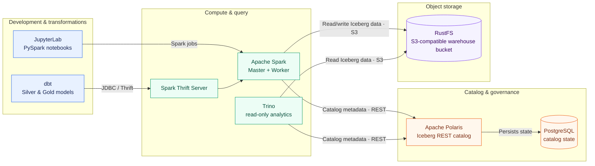

# Lakehouse Unplugged

Lakehouse Unplugged is a laptop-first playground for learning how an open
lakehouse fits together. It combines Apache Spark, Apache Iceberg, Apache
Polaris, RustFS, dbt, JupyterLab, Trino, and an experimental Airflow setup
in one Docker Compose stack.

The default architecture is:



> This repository is intended for local development, learning, and migration
> validation. RustFS runs in single-node, single-disk mode and the default
> credentials are development credentials. The pinned RustFS release is a beta
> pre-release. Do not use this setup as-is in production.

## What is included?

| Component | Purpose | Status |
|---|---|---|
| RustFS | S3-compatible object storage | Working, single-node proof of concept |
| Spark master and worker | ETL and distributed processing | Working |
| Spark Thrift Server | JDBC/Thrift endpoint for dbt | Working |
| Polaris | Iceberg REST catalog and governance | Working |
| Polaris UI | Read-only view of Polaris resources | Working |
| JupyterLab | Interactive PySpark development | Working |
| dbt | Silver and Gold transformations through Spark | Working |
| Trino | Read-only SQL analytics through Polaris | Working |
| VS Code devcontainer | Development and dbt authoring environment | Working |
| Airflow and Cosmos | Orchestration experiment | Work in progress |

## Prerequisites

- Docker Desktop or Docker Engine with Docker Compose v2
- Git
- A browser
- Approximately 6 GB of available memory and 4 CPU cores
- macOS, Linux, or Windows 11 with WSL2
- VS Code with the Dev Containers extension if you want to use the
  devcontainer workflow

## Quick start

### 1. Clone the repository

```bash
git clone https://github.com/GetSpiffed/lakehouse-unplugged.git
cd lakehouse-unplugged
```

### 2. Build the images in the correct order

The Jupyter image uses the repository's local Spark base image in its `FROM`
instruction. Build that base image before building the other project images:

```bash
# Build lakehouse-unplugged-spark-base:latest first
docker compose build spark-base-builder

# Build Jupyter and the other repository-owned images
docker compose build
```

The first build downloads several images, packages, and JAR files and can take
a while. Later builds normally reuse Docker's layer cache.

### 3. Start the stack

```bash
docker compose up -d
```

Check the startup status:

```bash
docker compose ps
```

Storage consumers wait for the RustFS health check and the one-shot bucket
initializer. Catalog consumers wait for the Polaris catalog bootstrap. If a
service is still starting, inspect its logs:

```bash
docker compose logs -f <service-name>
```

### 4. Open the user interfaces

| Service | Endpoint | Notes |
|---|---|---|
| Polaris UI | http://localhost:3000 | Read-only UI |
| RustFS Console | http://localhost:9001 | Browse and manage local object storage |
| Spark Master UI | http://localhost:8080 | Spark applications and workers |
| Spark Worker UI | http://localhost:8081 | Worker status |
| JupyterLab | http://localhost:8888 | No token in this local setup |
| Trino UI | http://localhost:8088 | Query status |
| Airflow UI | http://localhost:8089 | `admin` / `admin`; work in progress |
| Polaris API | http://localhost:8181 | REST API |
| Polaris health | http://localhost:8182/q/health | Health endpoint |
| RustFS S3 API | http://localhost:9000 | Authenticated S3-compatible API |
| Spark Thrift Server | `jdbc:hive2://localhost:10000` | JDBC endpoint for dbt and SQL clients |

Opening `http://localhost:9000` directly in a browser returns an
`AccessDenied` XML response. That is expected: it is an S3 API and its requests
must be signed with the S3 credentials from `.env`. Use the RustFS Console on
port `9001` to browse the files.

## First checks

These checks confirm that the main path through the stack is working.

### Run the dbt smoke test

The `dbt` service stays running as a command environment. Execute dbt inside
that container:

```bash
docker compose exec dbt dbt debug
docker compose exec dbt dbt run --select smoke
docker compose exec dbt dbt test --select smoke
```

The Thrift Server creates `polaris.default` during startup, so no manual
namespace setup is required.

### Check Polaris from Spark

```bash
docker compose exec spark-master bash -lc \
  "/opt/spark/bin/spark-sql -e 'SHOW CATALOGS'"
```

### Query with Trino

```bash
docker compose exec trino trino \
  --execute "SHOW SCHEMAS FROM polaris;"
```

Trino is intentionally configured for read-only analytics in this project.

## Development workflows

### Jupyter notebooks

Notebooks run in the dedicated `jupyter` service, not in the devcontainer.
Open http://localhost:8888 and start with:

```text
src/notebooks/00_setup_and_test.ipynb
```

The notebook is mounted from the repository, connects to
`spark://spark-master:7077`, and uses the same Polaris and generic S3
configuration as the Spark services.

If the `polaris` catalog is missing from an existing notebook session, restart
the kernel or recreate Jupyter:

```bash
docker compose up -d --force-recreate jupyter
```

### dbt in the VS Code devcontainer

Use this route for model development and authoring:

1. Start the stack with `docker compose up -d`.
2. Open the repository in VS Code.
3. Run **Dev Containers: Reopen in Container** from the Command Palette.
4. In the devcontainer terminal, run:

```bash
cd /workspace/dbt
dbt deps
dbt debug
dbt run --select smoke
dbt test --select smoke
```

The profile in `dbt/profiles.yml` connects to `thrift-server:10000`.
Restart the devcontainer after changing connection-related environment
settings.

By default, the project writes models to the `silver` and `gold` namespaces.
`dbt/macros/generate_schema_name.sql` uses the explicitly configured schema
without adding the target schema as a prefix.

Run the transformation layers with:

```bash
dbt run --select silver --full-refresh
dbt test --select silver --indirect-selection=empty

dbt run --select gold --full-refresh
dbt test --select gold
```

### dbt from the host

If you do not need the devcontainer, run the same commands in the existing dbt
container:

```bash
docker compose exec dbt dbt debug
docker compose exec dbt dbt ls
docker compose exec dbt dbt run --select silver --full-refresh
docker compose exec dbt dbt test --select silver --indirect-selection=empty
docker compose exec dbt dbt run --select gold --full-refresh
docker compose exec dbt dbt test --select gold
```

### Trino

You can use the Trino CLI inside its container:

```bash
docker compose exec trino trino \
  --execute "SHOW TABLES FROM polaris.bronze;"

docker compose exec trino trino \
  --execute "SELECT * FROM polaris.bronze.gekentekendevoertuigen LIMIT 10;"
```

Equivalent SQL:

```sql
SHOW SCHEMAS FROM polaris;
SHOW TABLES FROM polaris.default;
SELECT * FROM polaris.default.your_table LIMIT 10;
```

### Airflow

Airflow and Cosmos are included as a work in progress and are not yet
functionally integrated into the end-to-end workflow. When the full stack is
running, the UI is available at http://localhost:8089 with `admin` / `admin`.

To start only the Airflow services:

```bash
docker compose up -d \
  airflow-db airflow-init airflow-webserver airflow-scheduler airflow-triggerer
```

## How the architecture fits together

All services communicate through the `lakehouse` Docker network.

- **Spark** performs processing and writes Iceberg tables.
- **Polaris** is the default catalog and source of truth for Iceberg metadata,
  namespaces, roles, and catalog access.
- **RustFS** stores the Iceberg data files in the `warehouse` bucket through
  its standard S3-compatible interface.
- **dbt** sends SQL to the Spark Thrift Server and builds the Silver and Gold
  layers.
- **JupyterLab** provides an interactive Spark driver for experiments and
  notebook-based development.
- **Trino** reads the Iceberg tables through Polaris.
- **The devcontainer** contains development tools and dbt, but no separate
  Spark installation.

### Storage paths

Two URI schemes are used deliberately:

- Landing-zone or direct filesystem access uses `s3a://...` through Hadoop
  S3A.
- Iceberg tables managed through Polaris use `s3://...` through Iceberg
  `S3FileIO`.

Example direct read:

```python
spark.read.json("s3a://warehouse/landing/file.json")
```

The shared Spark image contains the matching Iceberg runtime, AWS bundle,
`hadoop-aws`, and AWS SDK JARs.

### Polaris and filesystem catalog modes

Polaris is the default:

```text
Spark → Polaris REST catalog → Iceberg data through the S3 API → RustFS
Trino → Polaris REST catalog → Iceberg data through the S3 API → RustFS
```

A Hadoop filesystem catalog remains available for troubleshooting:

```text
Spark → Hadoop catalog → Iceberg data through the S3 API → RustFS
```

Set `SPARK_CATALOG_MODE` to `polaris` or `filesystem` for the relevant Spark
services in `docker-compose.yml`, then recreate them:

```bash
docker compose up -d --force-recreate \
  spark-master spark-worker thrift-server jupyter
```

Changing catalog mode does not require rebuilding the image.

## Docker image layering

The repository has one important local image dependency:

```text
apache/spark:3.5.1
└── lakehouse-unplugged-spark-base:latest
    ├── spark-master
    ├── spark-worker
    ├── thrift-server
    └── lakehouse-unplugged-jupyter:latest
```

`spark-base-builder` adds Java, Python 3.11, Spark configuration, Iceberg, and
the S3-related JARs to the upstream Spark image. Spark master, worker, and
Thrift Server use this image directly. Jupyter builds an extra layer on top
with JupyterLab and its Python kernel.

The dbt, devcontainer, Polaris bootstrap, Polaris UI, and Airflow images use
their own upstream base images. All Airflow runtime services reuse
`lakehouse-unplugged-airflow:latest`, which is built through `airflow-init`.

After changing `docker/spark-base/`, rebuild both the base and its derived
Jupyter image:

```bash
docker compose build spark-base-builder
docker compose build jupyter
docker compose up -d --force-recreate \
  spark-master spark-worker thrift-server jupyter
```

## Polaris read-only UI

The `polaris-ui` service is a Next.js application that makes server-side,
read-only resource requests to Polaris. The UI offers no actions that create,
change, or delete Polaris resources. Its backend only uses `POST` to obtain an
OAuth token.

Start or rebuild only this service with:

```bash
docker compose up -d --build polaris-ui
```

Inside the Compose network, the UI uses
`POLARIS_BASE_URL=http://polaris:8181` together with `POLARIS_CLIENT_ID` and
`POLARIS_CLIENT_SECRET` from `.env`. Depending on the Polaris configuration,
individual management endpoints can return `401`, `403`, or `404`; the UI
presents these as read-only error states.

The endpoint mapping is defined in
`docker/polaris-ui/src/lib/polaris.ts`.

## Common operations

### Show status and logs

```bash
docker compose ps
docker compose logs --tail 100
docker compose logs -f <service-name>
```

### Stop and restart

Stop the containers while retaining all named-volume data:

```bash
docker compose down
```

Start them again:

```bash
docker compose up -d
```

### Full reset

This removes the containers and all named volumes, including RustFS,
Polaris, Trino, and Airflow data:

```bash
docker compose down -v
docker compose up -d
```

On Windows, `scripts/Reset-Lakehouse.ps1` provides a guided reset flow. Review
its options before using it when you want to retain existing data.

### Additional validation

Check the Python version shared by the Spark driver and executors:

```bash
docker compose exec spark-worker \
  bash -lc "/opt/py311/bin/python --version"

docker compose exec spark-master \
  bash -lc 'echo "$PYSPARK_PYTHON"'
```

In a PySpark notebook:

```python
print("default catalog =", spark.conf.get("spark.sql.defaultCatalog", ""))
print("range count =", spark.range(1).count())
```

## Configuration

Local defaults are stored in `.env`. Important settings include:

| Variable | Default purpose |
|---|---|
| `S3_ENDPOINT` | Internal S3-compatible endpoint (`http://rustfs:9000`) |
| `S3_PUBLIC_ENDPOINT` | Host-facing S3-compatible endpoint used by checks (`http://localhost:9000`) |
| `S3_BUCKET` | Object-storage bucket |
| `S3_ACCESS_KEY` / `S3_SECRET_KEY` | Local object-storage credentials |
| `S3_REGION` | S3 signing and client region |
| `S3_PATH_STYLE_ACCESS` | Force path-style S3 requests for local storage |
| `S3_SSL_ENABLED` | Enable S3A TLS; `false` for the local HTTP endpoint |
| `POLARIS_CLIENT_ID` / `POLARIS_CLIENT_SECRET` | Local Polaris credentials |
| `POLARIS_URI` | Internal Polaris catalog endpoint |
| `POLARIS_PUBLIC_HEALTH_URL` | Host-facing Polaris health endpoint used by checks |
| `ICEBERG_WAREHOUSE` | Iceberg data location |
| `DBT_SPARK_PUBLIC_HOST` | Host-facing Spark Thrift hostname used by checks |
| `HADOOP_VERSION` / `AWS_SDK_VERSION` | Spark base-image build versions |

The checked-in values are local development defaults. Replace them for any
shared or externally accessible environment.

### Object-storage startup and troubleshooting

RustFS uses the official `rustfs/rustfs:1.0.0-beta.11` image. This is an exact
beta/pre-release pin. The deployment deliberately uses the simple
single-node, single-disk topology appropriate for this PoC. A named Docker
volume, `rustfs-data`, is mounted at `/data`; `rustfs-permissions` prepares that
volume for RustFS's non-root user before the server starts.

The S3 API listens on `9000`, the Console on `9001`, and the Compose health
check calls `http://localhost:9000/health`. After RustFS is healthy,
`object-storage-init` runs the pinned AWS CLI `2.35.21`, creates the configured
`S3_BUCKET` if necessary, verifies it, and exits. Re-running the initializer is
safe when the bucket already exists:

```bash
docker compose run --rm object-storage-init
```

Useful checks:

```bash
curl http://localhost:9000/health
docker compose logs rustfs
docker compose logs object-storage-init
docker compose run --rm --entrypoint /bin/sh object-storage-init -c \
  'aws --endpoint-url "$S3_ENDPOINT" s3api list-buckets'
```

Spark receives the generic endpoint, region, path-style, and SSL settings at
container startup. It uses standard Iceberg `S3FileIO` and Hadoop S3A clients.
Trino uses its native S3 client with the same generic settings. Polaris records
the unchanged logical warehouse paths `s3://warehouse/` and
`s3://warehouse/polaris`; no consumer uses a RustFS-specific API.

### Persistence and migration notes

Normal `docker compose down`, container recreation, and RustFS restarts retain
the `rustfs-data` volume. `docker compose down -v` or
`Reset-Lakehouse.ps1 -FullReset` deletes it and all other Compose-managed data
volumes.

The former SeaweedFS named volume is not referenced by the new Compose file and
is not automatically deleted. SeaweedFS's on-disk format cannot be mounted
directly as a RustFS data volume. Existing PoC objects must be recreated or
copied separately through the S3 API before retiring that old volume.

Polaris 1.7.0 continues to persist catalog state in `polaris-db-data`.
`polaris-admin` uses `apache/polaris-admin-tool:1.7.0` to bootstrap the JDBC
schema and `POLARIS` realm before the server starts; the 1.7.0 bootstrap is
idempotent for an existing realm. Polaris does not automatically migrate older
JDBC schemas. Back up a long-lived database and review the upstream relational
JDBC schema-upgrade notes before manually advancing its schema version. A fresh
volume receives the current schema during bootstrap.

## Project structure

```text
.
├── .devcontainer/        # VS Code devcontainer configuration
├── airflow/dags/         # Experimental Airflow DAGs
├── data/                 # Sample source data
├── dbt/                  # dbt project, models, macros, and profile
├── docker/               # Dockerfiles and service configuration
├── scripts/              # Validation and reset helpers
├── src/notebooks/        # Jupyter notebooks
├── .env                  # Local development settings
├── docker-compose.yml    # Complete local stack
└── README.md
```

## Version baseline

The repository currently pins:

- Apache Polaris `1.7.0`
- Apache Polaris Admin Tool `1.7.0`
- Apache Spark `3.5.1`
- Apache Iceberg runtime `1.10.0`
- Trino `480`
- RustFS `1.0.0-beta.11` (beta/pre-release)
- AWS CLI `2.35.21` for idempotent bucket initialization
- Python `3.11` for Spark drivers and executors

## Future extensions

- Complete Airflow/Cosmos orchestration
- Polaris credential delegation and fine-grained policies
- Apache Ossie support when Polaris supports it
- Metadata and lineage with OpenMetadata
- Data quality tooling such as Great Expectations or Soda
- DuckDB-based local analytics and CI checks
